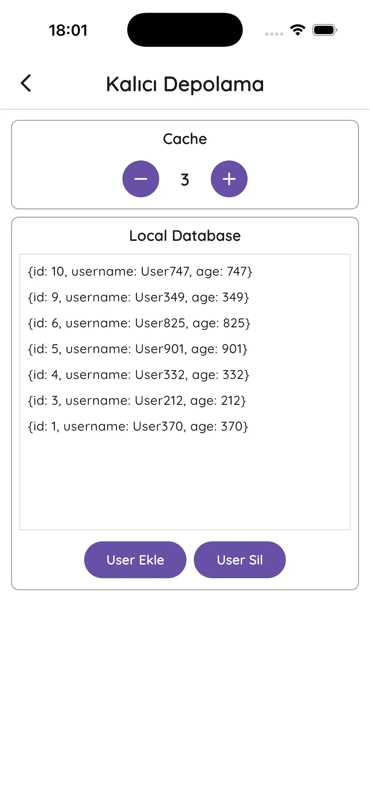
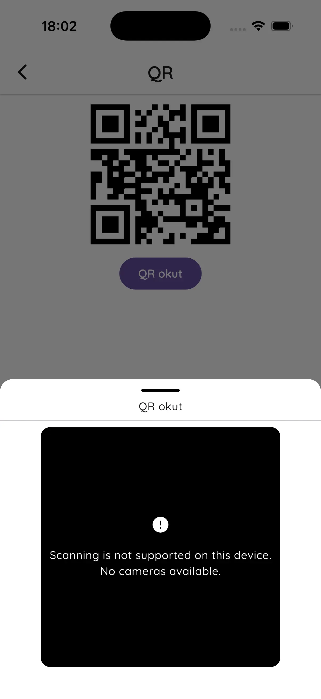
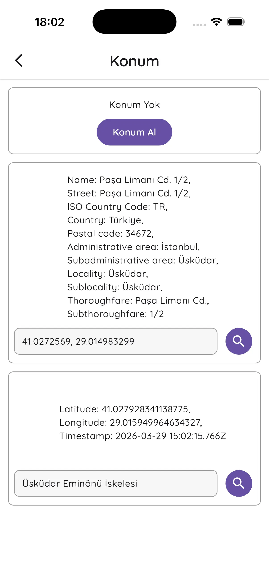
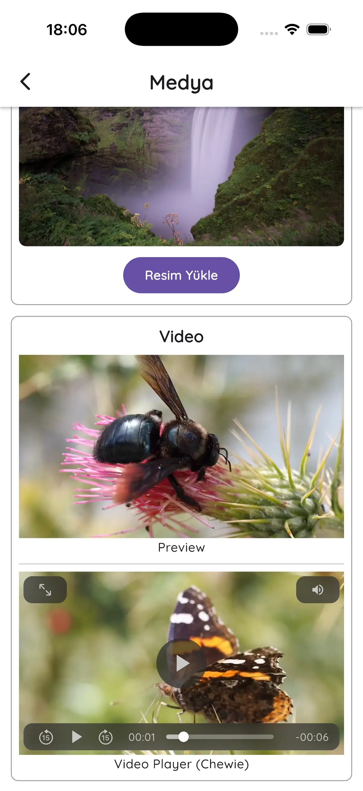
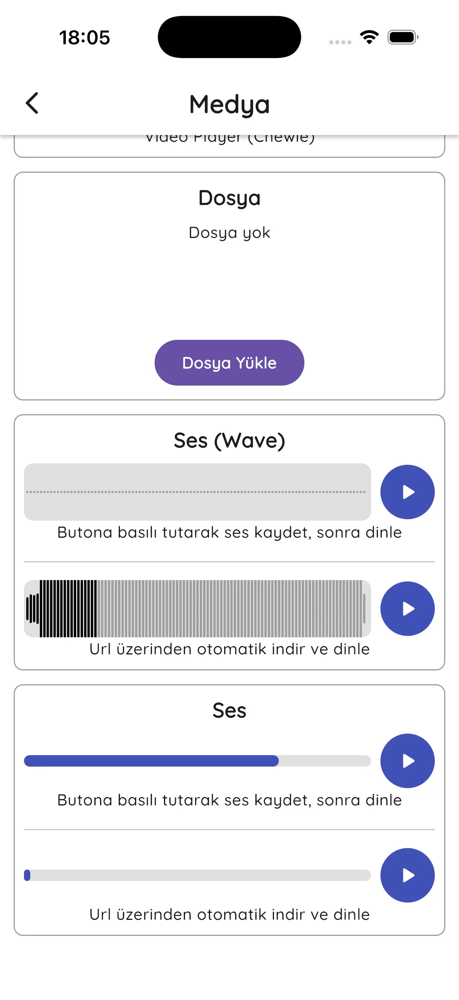
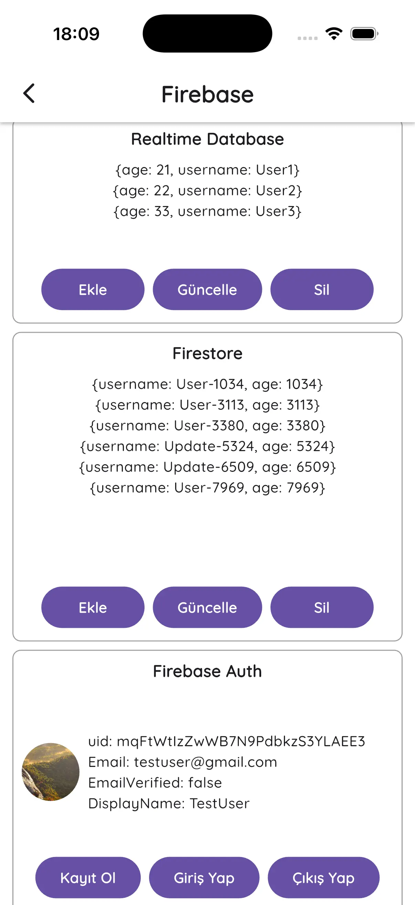

# **Flutter Services**

Flutter projeleri için, içerisinde API, Firebase, medya araçları, harita yardımcıları, bildirim sistemleri, depolama sistemleri ve QR gibi servisleri, özelleştirilebilir ve kullanıma hazır bir biçimde sunan bir servis katmanı.

⚠️ **Önemli Not!**  
Bu yapı bir pub.dev paketi değildir. Flutter projelerinde tekrar eden servis katmanlarını (API, Firebase, vb.) merkezi ve taşınabilir bir şekilde yönetmek amacıyla oluşturulmuştur.

🧩 **Nasıl Kullanılır?**  
Bu yapı tamamen esnek ve modülerdir. Doğrudan projelere entegre edilmek üzere tasarlanmıştır. İhtiyacınız olan servisleri seçerek doğrudan projenize ekleyebilirsiniz:
  - İlgili klasörü veya dosyayı kopyalayın
  - Projenizde uygun dizine yerleştirin (services/ gibi)
  - Gerekirse kendi ihtiyaçlarınıza göre özelleştirin

⚠️ **Dikkat Edilmesi Gerekenler**
  - Bazı servisler harici paketlere bağımlı olabilir (örn: dio, firebase)
  - Gerekli bağımlılıkları projenize eklemezseniz hata alabilirsiniz
  - Servisleri kullanmadan önce bağımlılıkları kontrol etmeniz önerilir

#

### Kullanılan kütüphaneler:

<table>
  <tr valign="top">
    <td>
      <ul>
        <li>API Service</li>
        <ul>
          <li>dio</li>
        </ul>
        <li>Firebase Service</li>
        <ul>
          <li>firebase_core</li>
          <li>firebase_analytics</li>
          <li>firebase_database</li>
          <li>cloud_firestore</li>
          <li>firebase_auth</li>
          <li>google_sign_in</li>
        </ul>
        <li>Media Service</li>
        <ul>
          <li>image_picker</li>
          <li>image_cropper</li>
          <li>flutter_image_compress</li>
          <li>file_picker</li>
          <li>video_player</li>
          <li>chewie</li>
          <li>audio_waveforms</li>
          <li>record</li>
          <li>just_audio</li>
        </ul>
      </ul>
    </td>
    <td>
      <ul>
        <li>Map Service</li>
        <ul>
          <li>google_maps_flutter</li>
          <li>geolocator</li>
          <li>geocoding</li>
        </ul>
        <li>Notification Service</li>
        <ul>
          <li>onesignal_flutter</li>
          <li>awesome_notifications</li>
          <li>firebase_messaging</li>
        </ul>
        <li>Storage Service</li>
        <ul>
          <li>hive</li>
          <li>hive_flutter</li>
          <li>sqflite</li>
          <li>shared_preferences</li>
        </ul>
        <li>Other</li>
        <ul>
          <li>qr_flutter</li>
          <li>mobile_scanner</li>
        </ul>
        <li>Base</li>
        <ul>
          <li>path_provider</li>
          <li>screenshot</li>
        </ul>
      </ul>
    </td>
  </tr>
</table>

#

### Araç Seti ( [toolkit](flutter_services/lib/services/toolkit) ):

- [extensions](flutter_services/lib/services/toolkit/extensions.dart): Mevcut sınıflara (String, DateTime vb.) yeni yetenekler kazandırarak kod yazımını kısaltır.

- [mixins](flutter_services/lib/services/toolkit/mixins): Çoklu kalıtım desteğiyle sınıflara ortak fonksiyonel özellikler ve davranışlar enjekte eder.

#

### API Servisi ( [api](flutter_services/lib/services/api) ):

Uzak sunucularla veri alışverişini ve hata yönetimini merkezi bir noktadan yönetir.

#

### Firebase Servisleri ( [firebase](flutter_services/lib/services/firebase) ):

Gerekli yapılandırma dosyalarını eklemeyi unutmayın!

- [Analytics](flutter_services/lib/services/firebase/analytics.dart): Kullanıcı davranışlarını analiz ederek uygulamanın performansını ve etkileşimini ölçer.

- [Realtime Database](flutter_services/lib/services/firebase/database.dart): Verilerin tüm kullanıcılar arasında anlık ve canlı olarak senkronize edilmesini sağlar.

- [Firestore](flutter_services/lib/services/firebase/firestore.dart): Esnek ve ölçeklenebilir doküman tabanlı veritabanı çözümü sunar.

- [Firebase Auth](flutter_services/lib/services/firebase/auth.dart): Kullanıcı kayıt ve giriş işlemlerini güvenli bir altyapı üzerinden gerçekleştirir.

- [Google Auth](flutter_services/lib/services/firebase/auth_google.dart): Google hesaplarıyla hızlı ve tek tıkla güvenli giriş imkanı sağlar.

#

### Medya Servisleri ( [media](flutter_services/lib/services/media) ):

- [camera](flutter_services/lib/services/media/camera.dart): Cihazın kamerasına veya fotoğraf galerisine erişerek görsel veri almanızı sağlar.

- [video](flutter_services/lib/services/media/video.dart): Yerel veya uzak sunucudaki video dosyalarını oynatmak ve kontrol etmek için kullanılır.

- [file](flutter_services/lib/services/media/file.dart): Cihaz depolama alanındaki doküman, PDF ve diğer dosya formatlarını yönetmenize yardımcı olur.

- [audio](flutter_services/lib/services/media/audio.dart): Uygulama içinde ses kaydı yapma veya ses dosyalarını yüksek performansla oynatma imkanı verir.

#

### Harita Servisleri ( [map](flutter_services/lib/services/map) ):

- [map](flutter_services/lib/services/map/map.dart): İnteraktif harita gösterimi ve harita üzerindeki işaretleme (marker) işlemlerini kolaylaştırır.

- [location](flutter_services/lib/services/map/location.dart): Kullanıcının anlık konum verilerini yüksek hassasiyetle takip etmeyi ve yönetmeyi sağlar.

#

### Bildirim Servisleri ( [notification](flutter_services/lib/services/notification) ):

- [onesignal](flutter_services/lib/services/notification/onesignal.dart): OneSignal altyapısını kullanarak uzak sunucu bildirimlerini alır ve işler.

- [local](flutter_services/lib/services/notification/local.dart): Yerel bildirimleri özelleştirilebilir tasarımlar ve gelişmiş zamanlama ile yönetir.

- [firebase](flutter_services/lib/services/notification/firebase.dart): Firebase Cloud Messaging (FCM) üzerinden uzak sunucu bildirimlerini alır ve işler.

#

### Depolama Servisleri ( [storage](flutter_services/lib/services/storage) ):

- [hive](flutter_services/lib/services/storage/hive.dart): Küçük boyutlu ayarların veya verilerin cihaz belleğinde hızlı erişilebilir şekilde tutulmasını sağlar.

- [sqflite](flutter_services/lib/services/storage/sqflite.dart): İlişkisel veya doküman tabanlı verilerin yerel bir veritabanında (SQLite vb.) güvenle saklanmasını yönetir.

#

### Diğer Servisler ( [other](flutter_services/lib/services/other) ):

- [qr](flutter_services/lib/services/other/qr.dart): Dinamik QR kodları oluşturmanıza veya kamera aracılığıyla mevcut kodları taramanıza olanak tanır.

 

# Demo İçerikleri

Aşağıda bazı servislerin kullanım örnekleri mevcuttur. İncelemek için [screens](flutter_services/lib/screens) klasörünü ziyaret edebilirsiniz.

  
  
  
  
  
  
  
  
  

